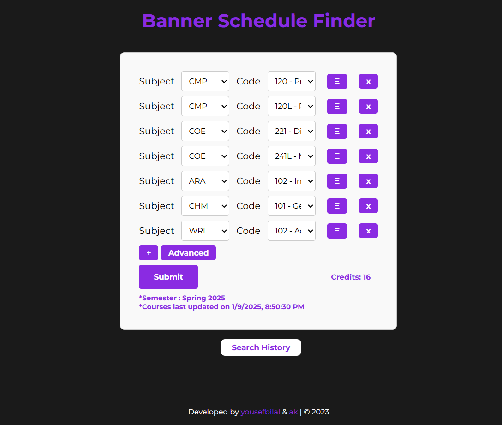
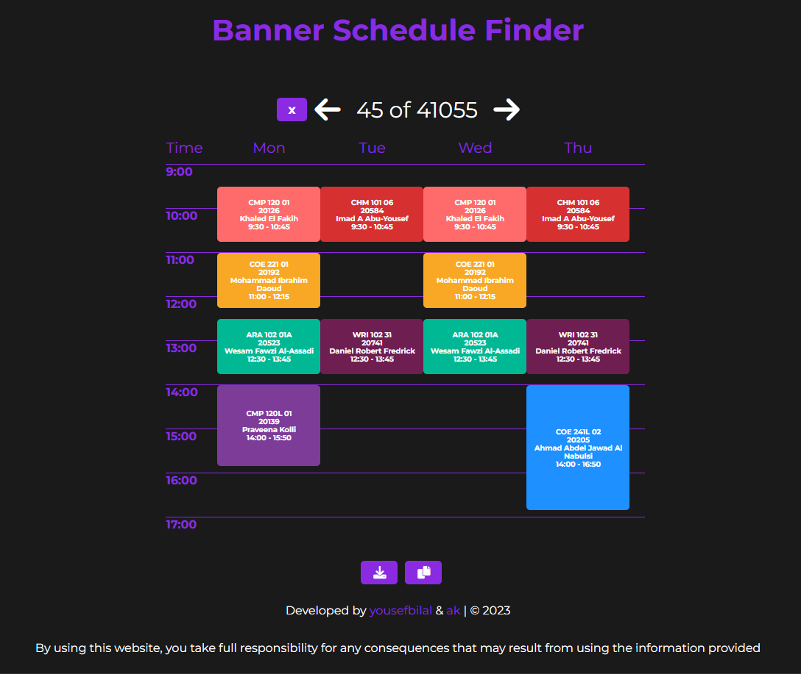

# banner-sched-finder

This web application was made to make it easier for the American University of Sharjah students to register their courses by generating all the possible schedules of the courses they want to take. It saves them the headache of checking their schedules against other courses for conflict and provides them with neat visualization of all the schedules they can register with the given courses. It must be noted that this web application is only intended to aid students in planning their schedules and it does not give any student an advantage in registering courses during the registration period, otherwise it will violate the university policy. 

Don't forget to star the repo ⭐

## Example


## Features

* **Generate all conflict-free course schedules.**
* **To the best of our knowledge, the schedules follow AUS course restrictions such as Labs and Recitations required with specific course sections**
* **Schedule visulization**
* **Customizing course section/s.**
* **Customizing break period.**
* **Stores history of previous searches**
* **Specific options such as: *No 8 AM Classes, Only Open Sections, No Classes after 5 PM*.**
* **Download schedule.**
* **Copy course CRNs.**

## Live App

A running version of the web application is currently hosted [here](https://aus-scheduler.com). The hosting of the server and the domain name fees are covered from my personal expense, so I would appreciate using it responsibly. 

## How Does it Work?

The front-end of the web application is built with Vanilla JavaScript, the backend is built with the Flask python backend framework, and data persistence is provided by a MongoDB database on the MongoDB Atlas platform. The database is populated by scraping the banner courses pages of the American University of Sharjah, and it is updated continuosly according to a cron job running the scraper. The source code of the scraper will not be disclosed to avoid any issues that will be caused to universitie's website.

The algorithm that generates the schedules is deterministic and simple. We use Backtracking with the goal of finding all possible schedules from the courses provided while checking for constraint violaation at every step. This bruteforce solution is what makes it elegant in my opinion. Often, especially for first-year students, the number of schedules available is enormous (reaching hundreds of thousands). This would cause memory and network issues because the schedules have to be stored and send down the wire. However, we adopted [HTTP Streaming](https://developer.mozilla.org/en-US/docs/Web/API/Streams_API) for sending the schedules as they are being generated, avoiding memory and network issues. It also works hand in hand with the computational complexity of Backtracking because useres can see the results incrementally instead of waiting for the entire generation of schedules.

## Running a Local Server

### Prerequisites

* **Python 3.11+**
* **MongoDB database**
* **`MONGODB_URI` environment variable in `.env` file of the root of the project**


Note that the front-end is developed with Vanilla JavaScript and hence no bundler is required to build the front-end.

### 1. Clone the repository

```bash
$ git clone https://github.com/yousefbilal/banner-sched-finder.git

$ cd banner-sched-finder
``` 

### 2. Install required packages 

* **Windows**
```bash
# create a virtual environment
$ py -m venv .venv 
# activate the virtual environment
$ .venv/Scripts/activate
# install required packages
$ pip install -r requirements.txt
```

Note: if an error shows up about ExecutionPolicy while activating the environment in powershell simply run `Set-ExecutionPolicy unrestricted`. It is advised to read more about the implications of this ExecutionPolicy as it may be a security risk if you don't know what you are doing. 

* **Linux and MacOS**
```bash
$ python3 -m venv .venv

$ . .venv/bin/activate

$ pip3 install -r requirements.txt
```

### 3. Run the web server

* **Windows**  
```bash
$ python app.py
```
* **Linux and MacOS**
```bash
$ python3 app.py
```

### Docker (Alternative)

For deployment purposes, a Dockerfile and compose are provided for running the web app. Running the following command will build and run a Docker container of the app exposed on port localhost:8080.

```bash
$ docker compose -f docker-compose.dev.yml up -d
```

Note that Gunicorn WSGI is used to run the app using Docker as opposed to running `app.py` which uses Flask's development server.

### Credits

Developed by [_yousefbilal_](https://github.com/yousefbilal) & [_akvn_](https://github.com/akvnn) 
